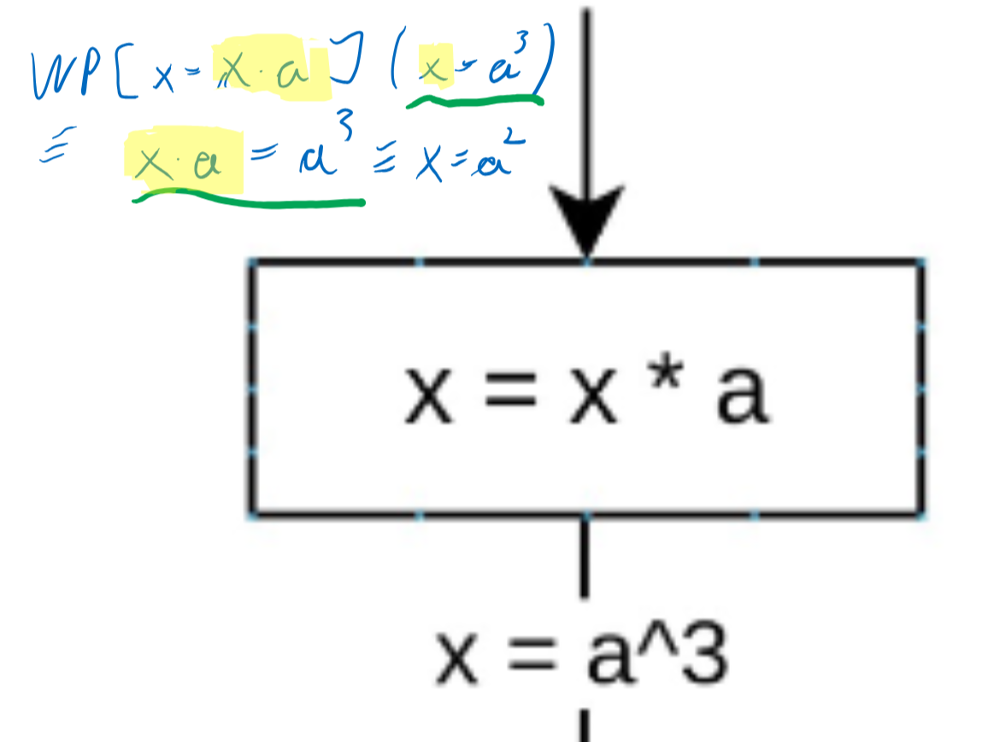
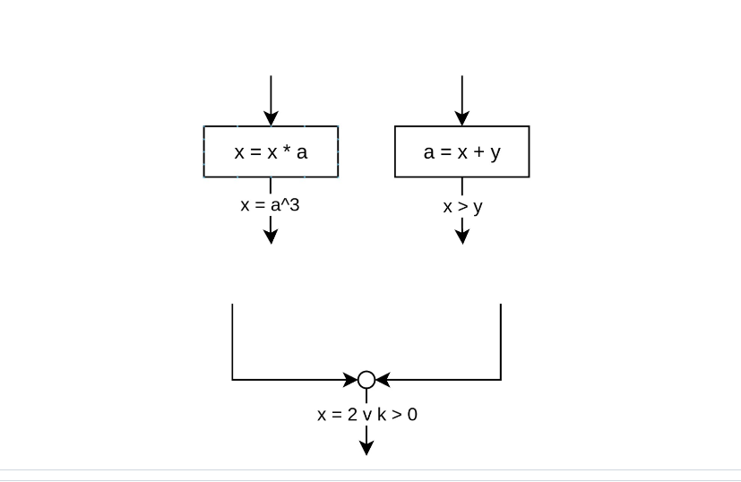

# Basic Logic

$A \implies B \ \equiv \ \overline{A} \lor B$

$\text{A stronger B} \ \equiv \ A \implies B$

$true$ is the weakest statement \
$false$ is the strongest statement


# Weakest Precondition
$\pmb{WP}[\![ x=read() ]\!](A) \equiv \forall x: A$ \
$\pmb{WP}[\![ write(expr) ]\!](A) \equiv A$ \
$\pmb{WP}[\![ x = expr ]\!](A) \equiv  A[expr/x]$

$A[expr/x]$ means: replaces all occurences of x in A with the *right* part of the expression. \
Example: \



$\pmb{WP}[\![ c ]\!](B_{false}, B_{true}) \equiv$ \
$ (\overline{c} \land B_{false}) \lor (c \land B_{true}) \equiv$ \
$(c \implies B_{true}) \land (\overline{c} \implies B_{false})$ 

# Local Consistency
 \
$\text{A and B are loc. cons.} \equiv A \implies \pmb{WP}[\![ s ]\!](B) $ \
$\equiv \pmb{SP}[\![ s ]\!](A) \implies B$ \
Assertions generatet by the ```WP``` and ```SP``` operator are by default locally consistent.